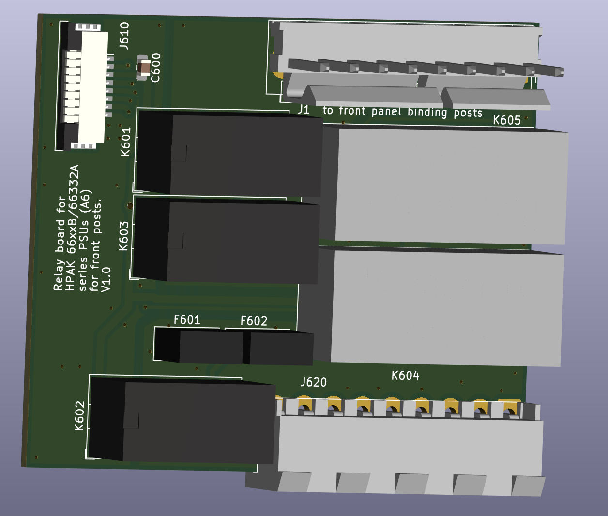
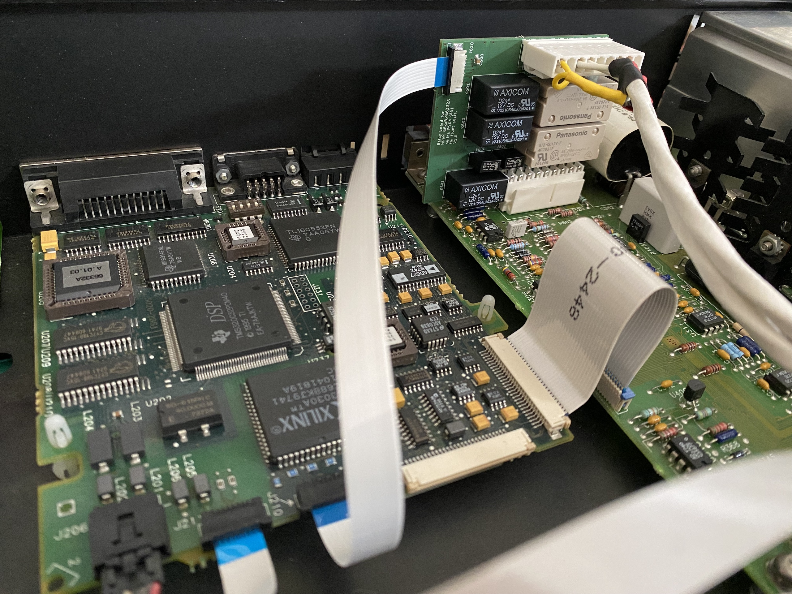
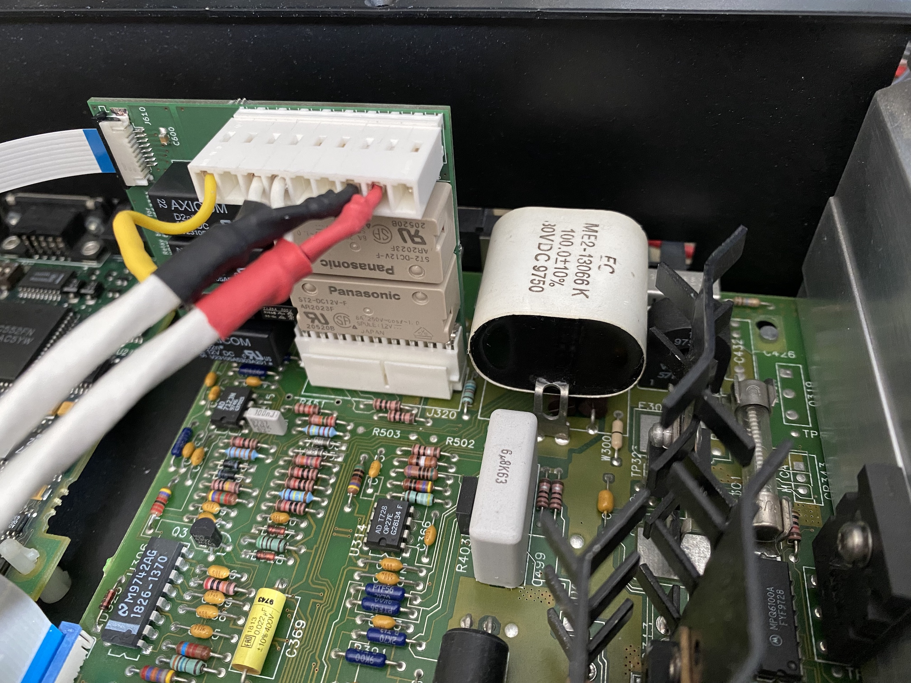
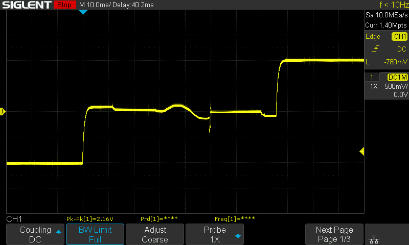

HP 66332A and HP 6632B-6634B #760 Relay Option Board
===================
This repository contains the schematics for a PCB to mount a relay board in an HP 6632B (and siblings) power supply. It is an adaption of the original A6 PCB used in option #760 units.
This relay board allows 2 things:
- the use of these power supplies as a 4 quadrant "poor man's SMU" (but with relay glitches).
- to isolate the output. In some situations, like with a large capacitive load or a battery, it is possible to damage the PSU's crowbar circuit when switching the output off. This board allows the disconnection of the output terminals. 

It is not needed to recalibrate the device after installation, although it would not hurt.

Once installed, you will NOT see the option appear when requesting `*OPT?` via the control interface (RS232/GPIB) (at least not on firmware 1.03). You will now however be able to use the relay control options in the front panel menu (under Output), or via `OUTPout`, `OUTPut:RELay`, and `OUTPut:RELay:POLarity`.

In contrast to the original option #760 PCB, this board:
- is meant to be used with front binding posts. See [option 020 board](https://github.com/hb020/HP6632B_binding_posts). If you want to use it with the standard backside terminals: just add 4 connections from the top connector to the bottom connector, according to the original schema that can be found in the service manual (the relevant extract can be found [here](doc/66332A%20Service%20Manual_9018-01125_extract.pdf)).
- has other minor changes like swapping the ports on the driver IC and allowing the use of standard series resistors (at least, the series that I had). 
- makes no use of the MP23/06612-00005 "Relay Option Bracket", which you will likely not have anyway if you do not already have the #760 board. The board is small enough and the weight distribution is such that this is not likely to be a problem.

For the component choice I took inspiration from "lukier" on [eevblog](https://www.eevblog.com/forum/repair/agilent-6632b-fault-repair-and-several-design-flaws/msg1019018/#msg1019018). The main difference from his list was the FFC connectivity: 15cm is too short. I used molex 15267-0237: 20cm.

The components and layout chosen allow the board to be used on all variants of the HP 663xB family - even the 100 V 6634B.

The final result looks like this:

Board behaviour
-----
This board keeps the sense lines functional, and I have not seen an impact on accuracy.
The sign of the voltage and current as measured (and set) does not change when you switch to "reverse" mode (the display still continues to show a positive voltage, although the voltage on the terminals is now negative).

During relay switching there are the inevitable delays and small artifacts.
Below is a switch from -1V (Reversed) to +1V (Normal), with a 1MΩ load. The switchover takes a little less than 80ms. 

The sine wave in the middle of the screen is 50Hz mains hum, as during that period the PSU output is disconnected. That hum, and the small spike that follows it, are largely suppressed when a load is applied.

About
-----
The root folder contains the KiCAD files. 
The gerber files can be found in the [/gerber](gerber/) folder.

Documentation of some of the components, and an extract of the service manual, with the original board drawings, can be found in the [/doc](doc/) folder. All files are publicly available on the respective manufacturers's websites, and are copied here for convenience. If this poses problems, let me know.

Related Repositories and info
--------------------

You may want to combine this with the [option 020 Frontpanel Binding Posts](https://github.com/hb020/HP6632B_binding_posts).
